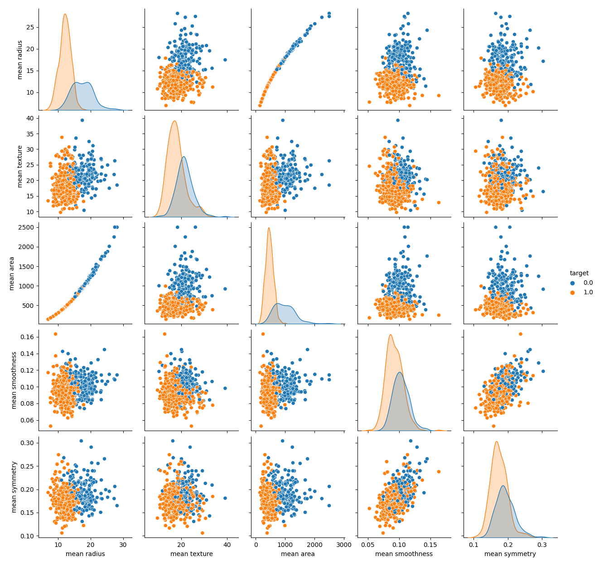
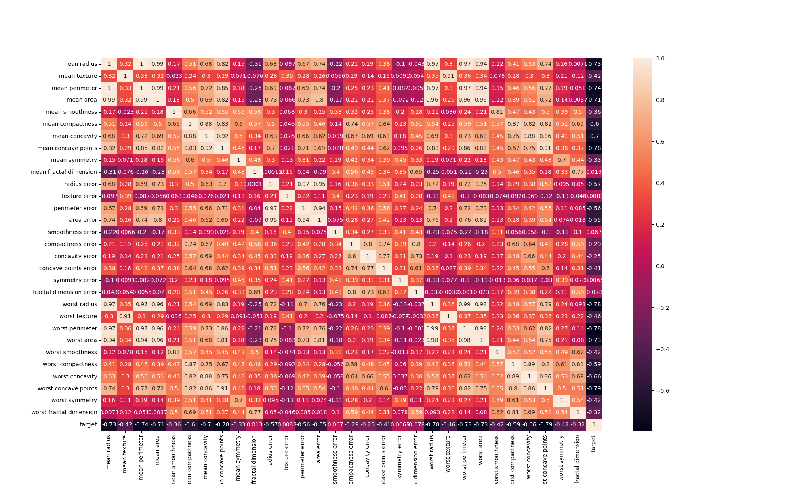

# Breast Cancer Predictor with SVM and PCA

This example uses the breast cancer wisconsin dataset


## Features Correlation


## Installation
```
git clone https://github.com/Hikki12/breast-cancer-svm

pip install -r requirements.txt
```

## Run
```
python main.py
```

## License
MIT
